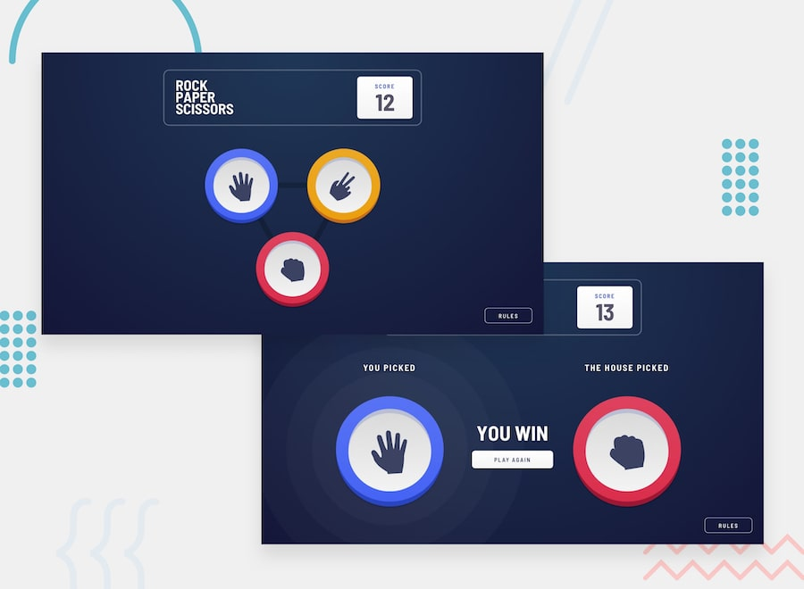

# Rock, Paper, Scissors

## 🔗 Live Demo (https://rock-paper-scissors-jt.netlify.app/)



A responsive Rock, Paper, Scissors game built with HTML, CSS, and JavaScript. This project was created as a Frontend Mentor challenge to practice DOM manipulation, game logic, responsive layout, and interactive UI behavior.

## Overview

This app lets users play Rock, Paper, Scissors against a randomly generated computer choice. After each round, the app displays the player’s choice, the computer’s choice, the result, and updates the score.

The goal of this project was to build a clean, interactive browser game while matching the provided Frontend Mentor design as closely as possible.

## Features

- Play Rock, Paper, Scissors against the computer
- Randomized computer selection each round
- Score tracking during the session
- Visual feedback for wins, losses, and ties
- Responsive layout based on the Frontend Mentor design
- Rules modal for quick reference

## Game Rules

The winner is determined by the classic Rock, Paper, Scissors rules:

- Rock beats Scissors
- Scissors beats Paper
- Paper beats Rock

If the player wins, their score increases by 1.  
If the computer wins, the player’s score decreases by 1.  
If both choices match, the round is a tie.

## Built With

- HTML5
- CSS3
- JavaScript
- Frontend Mentor starter assets

## What I Learned

This project helped me practice connecting JavaScript logic to visual UI updates. I worked with event-driven programming, random number generation, conditional logic, and updating DOM elements based on user interaction.

One of the main challenges was organizing the game flow so that each round clearly handled:

1. the user’s selected choice,
2. the computer’s random choice,
3. the result comparison,
4. and the score update.

I also gained more experience translating a static design into a responsive web layout.

## Future Improvements

Some improvements I would like to make include:

- Refactor the game logic into smaller reusable functions
- Replace inline click handlers with JavaScript event listeners
- Improve keyboard accessibility
- Add persistent score tracking with `localStorage`
- Add a reset score button
- Add animations between game states
- Add unit tests for the game result logic
- Deploy the project with GitHub Pages, Netlify, or Vercel

## Getting Started

To run this project locally:

```bash
git clone https://github.com/Jesse-Tingle/rock-paper-scissors.git
cd rock-paper-scissors
open index.html